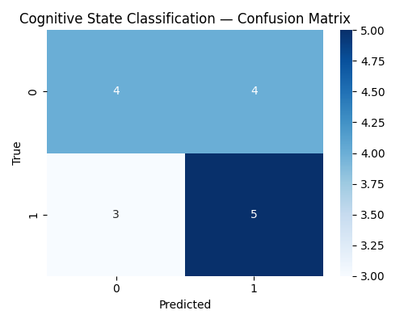
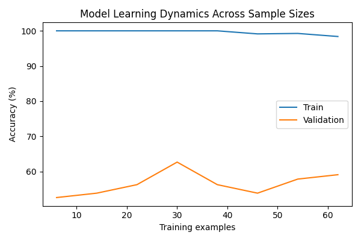
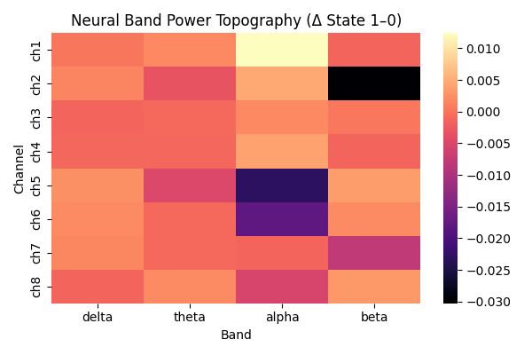

# 🧠 SynapseNet: Simulated Neural Signal Classifier

SynapseNet is a neuroscience-inspired deep learning project that simulates and classifies synthetic brain signals using convolutional neural networks.

The project generates synthetic EEG-like data and trains a lightweight neural model to distinguish between two simulated mental states :- “focused” and “calm”.  
It demonstrates how neural time-series data can be processed, visualized, and learned by AI systems, laying the groundwork for future brain-computer interface (BCI) research.

---

## 🔍 Overview  
**SynapseNet** is a proof-of-concept project that simulates brain-like electrical signals and trains a neural network to classify cognitive states (such as *calm* vs. *focused*) based on those signals.  

While the data here is synthetic, the pipeline mirrors real EEG workflows, from signal generation and preprocessing to neural classification, making this a compact demonstration of how artificial intelligence can model neural activity.

This project was built as part of my neuroscience + AI research portfolio, showing the power of computational models to decode patterns from complex biological data.

---

## 🚀 Features
- 🧩 **Synthetic Brain Data Simulation** :- Generates multi-channel EEG-like signals using mathematical models.  
- 🧠 **Neural Network Classifier** :- A CNN-based architecture trained on temporal patterns.  
- 📈 **Data Visualization** :- Includes amplitude-time plots and training loss curves.  
- 🔬 **Lightweight & Reproducible** :- No external hardware or costly dependencies required.  

---

## 🧰 Tech Stack
- **Python 3.11+**
- **TensorFlow / scikit-learn**
- **Matplotlib, NumPy, Pandas**
- **MNE** for EEG-style signal simulation

---

## 🧪 Visual Results
Example outputs generated during training and signal analysis:

| Brain Signal Simulation | Training Loss Curve | Neural Band Power Topography |
|--------------------------|---------------------|
|  |  |   | 

---

## 👨‍💻 Author  
**Devansh Sharma**  
*Neuroscience & Artificial Intelligence Research Enthusiast*  

